# PredomicsApp

<p align="center">
  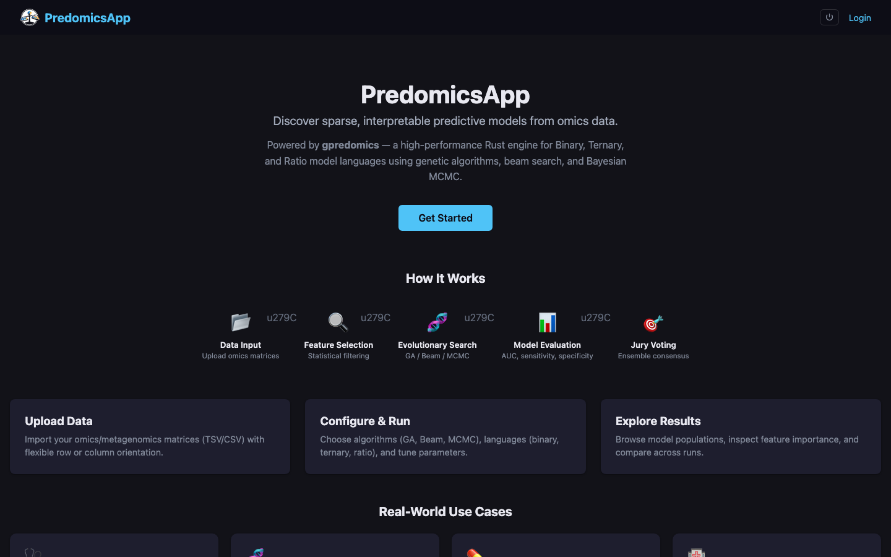
</p>

Modern web application for **[gpredomics](https://github.com/predomics/gpredomics)** — sparse, interpretable ML model discovery for omics data.

PredomicsApp provides an intuitive interface for running genetic-algorithm-based feature selection and model building on metagenomic, transcriptomic, and other high-dimensional biological datasets. It wraps the [gpredomicspy](https://github.com/predomics/gpredomicspy) engine (Rust + Python) in a full-stack web application with real-time progress tracking, interactive visualizations, and collaborative features.

## Features

### Core Analysis
- **Project-based workflow** — Create projects, upload datasets, configure parameters, launch analyses, and explore results
- **Multiple model languages** — Binary, ternary, ratio, and power-of-2 encodings
- **Batch parameter sweeps** — Launch up to 50 jobs with cartesian product of parameter grids
- **Interactive results** — AUC evolution, model coefficients, radar charts, feature prevalence, and population analysis
- **Co-presence analysis** — Pairwise feature co-occurrence with hypergeometric significance test, heatmap, and network visualization
- **Comparative view** — Side-by-side job comparison with metrics and configuration diff
- **MSP annotations** — Automatic taxonomic and functional annotations from [biobanks.gmt.bio](https://biobanks.gmt.bio)

### Analytics & Deployment
- **External validation** — Score new samples against trained models with AUC, accuracy, confusion matrix
- **Prediction API** — Deploy models as JSON endpoints (`POST /api/predict/{job_id}`) with API key auth
- **PDF biomarker reports** — Publication-ready PDF with metrics, feature tables, and configuration summary
- **Dashboard overview** — Global stats, running jobs, recent completions, and activity feed

### Export & Reports
- **CSV exports** — Coefficients, population, jury, and generation tracking
- **HTML reports** — Self-contained with embedded charts and metrics
- **Python/R notebooks** — Pre-filled `.ipynb` and `.Rmd` with actual parameters

### Collaboration & Sharing
- **Project comments** — Threaded notes/discussion per project with edit/delete
- **Public sharing links** — Read-only access via unique token URLs (no login required), with expiry and revoke
- **Project sharing** — Share projects with other users as viewer or editor
- **Real-time logs** — WebSocket live log streaming with HTTP polling fallback

### Infrastructure
- **Multi-user auth** — JWT Bearer tokens + API keys (`X-API-Key` header)
- **Admin panel** — User management, audit log, backups, parameter templates
- **Dataset versioning** — Automatic snapshots on file changes with restore
- **Webhook notifications** — HTTP POST callbacks with HMAC-SHA256 signing
- **Rate limiting** — Per-user and per-IP limits via slowapi
- **Dark theme** — Full dark mode with consistent Plotly chart theming

## Screenshots

| Page | Screenshot |
|------|-----------|
| **Login** | 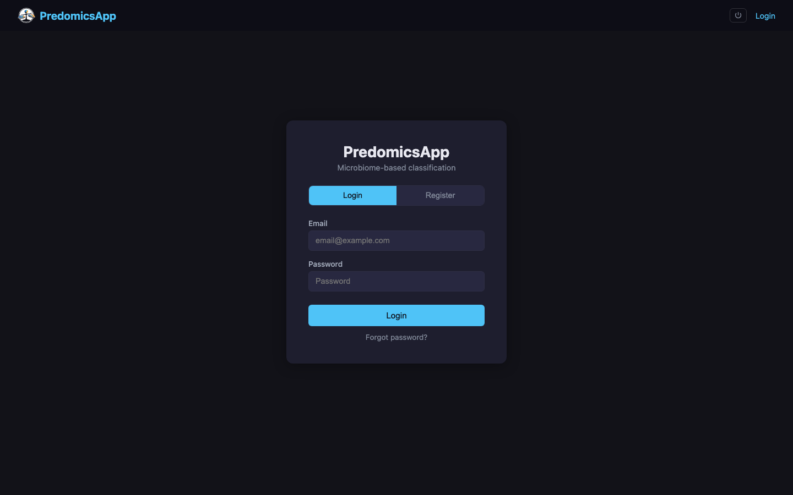 |
| **Dashboard** | 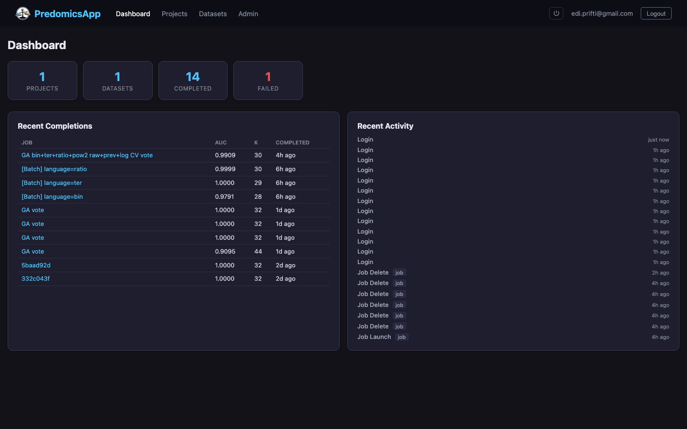 |
| **Projects** | 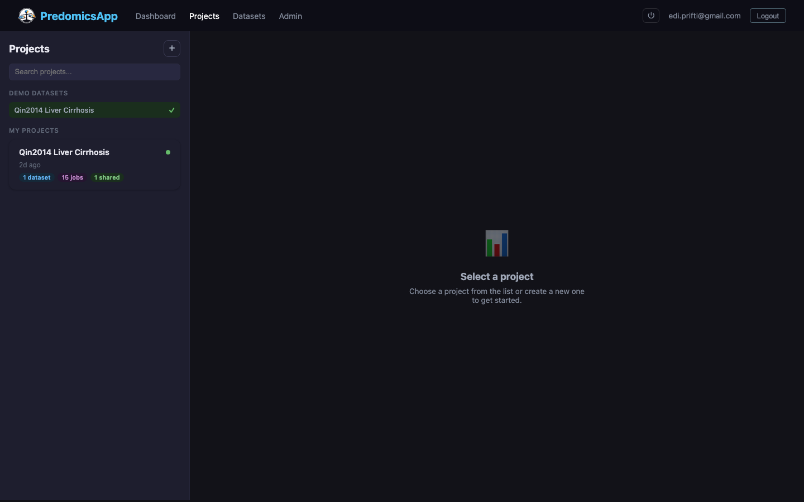 |
| **Data & Exploration** | 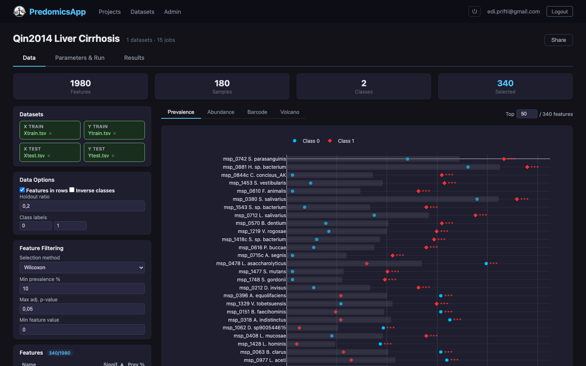 |
| **Parameters & Run** | 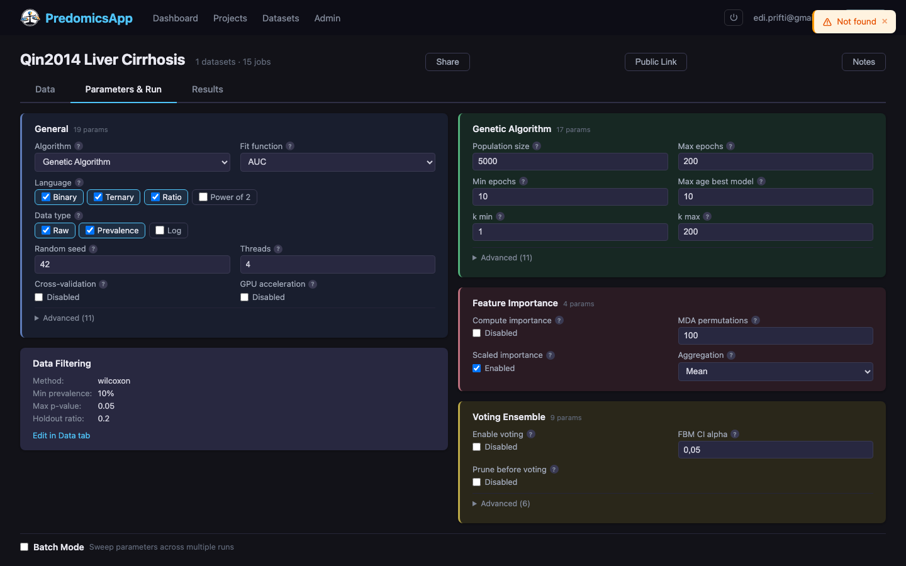 |
| **Results — Summary** | 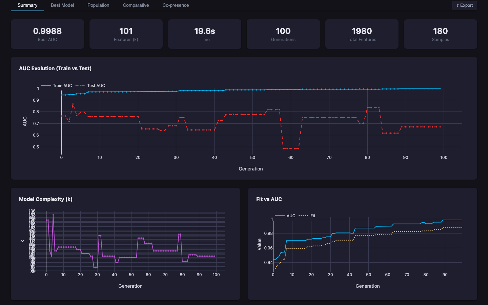 |
| **Results — Best Model** | 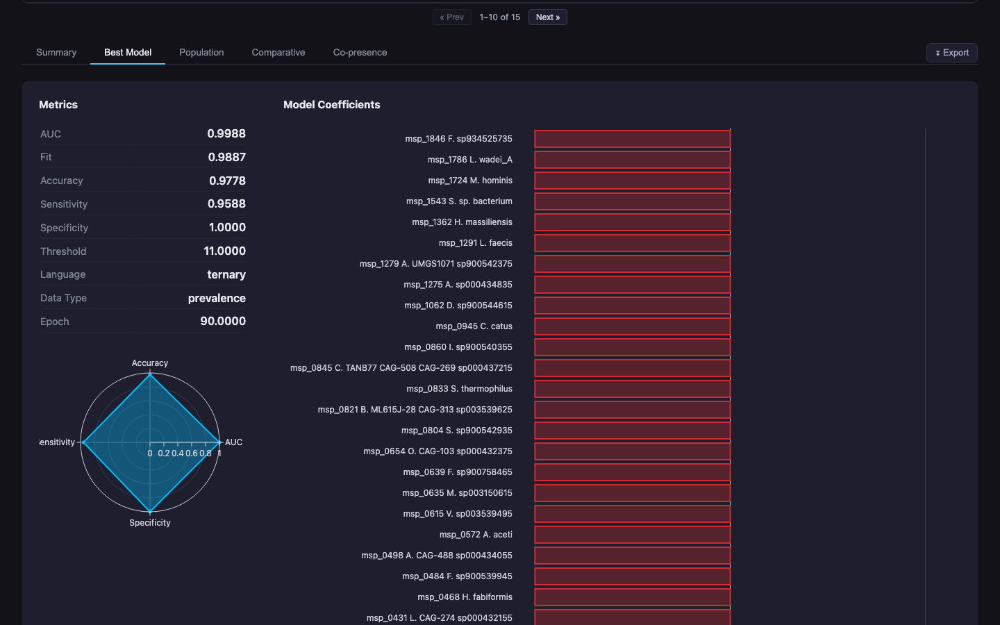 |
| **Results — Population** | 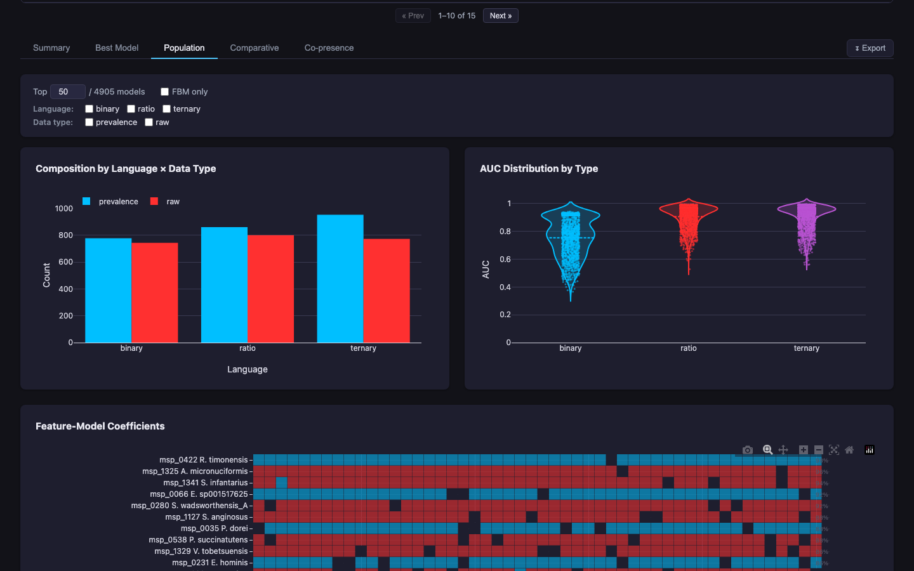 |
| **Results — Co-presence** | 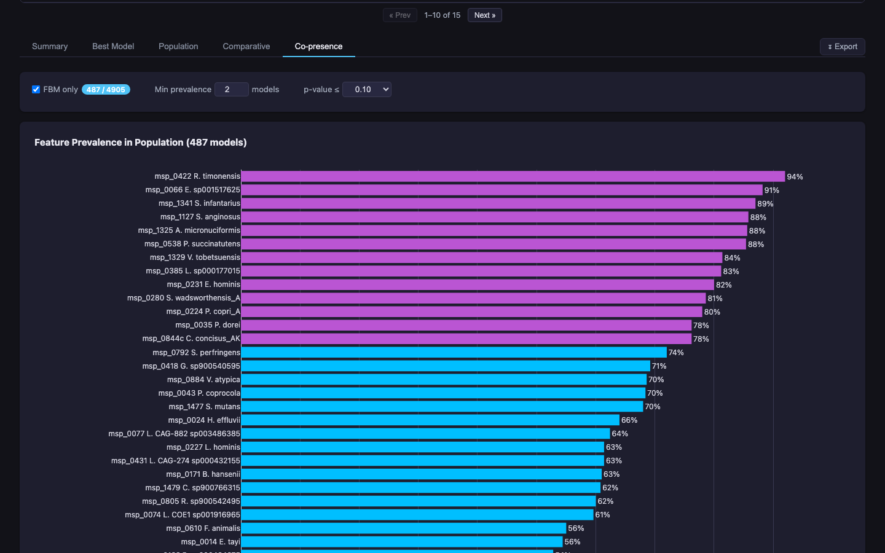 |
| **Co-presence — Network** | 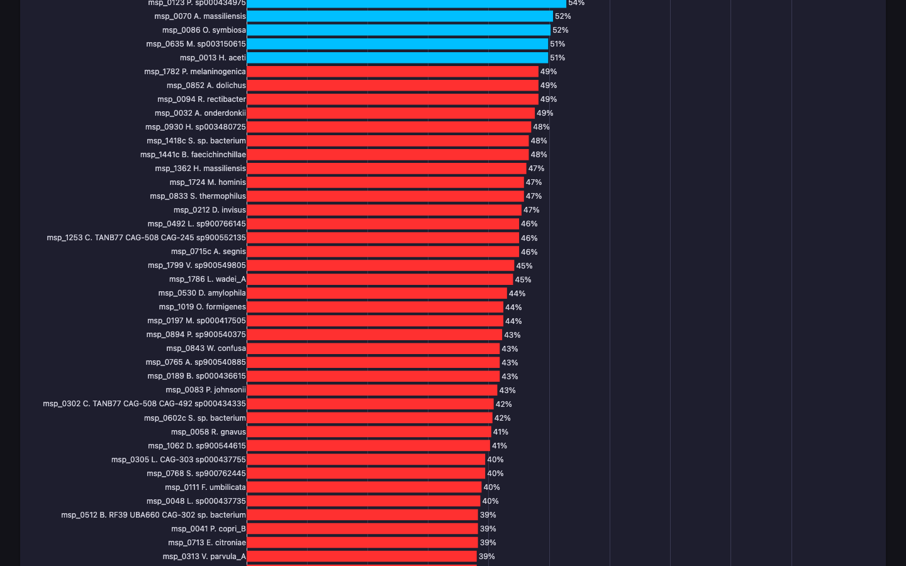 |
| **Results — Comparative** | 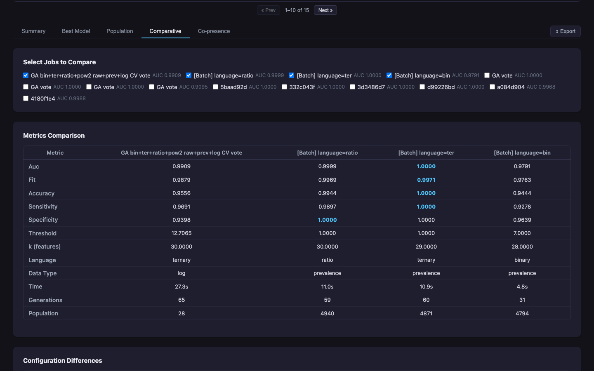 |
| **Public Share** | 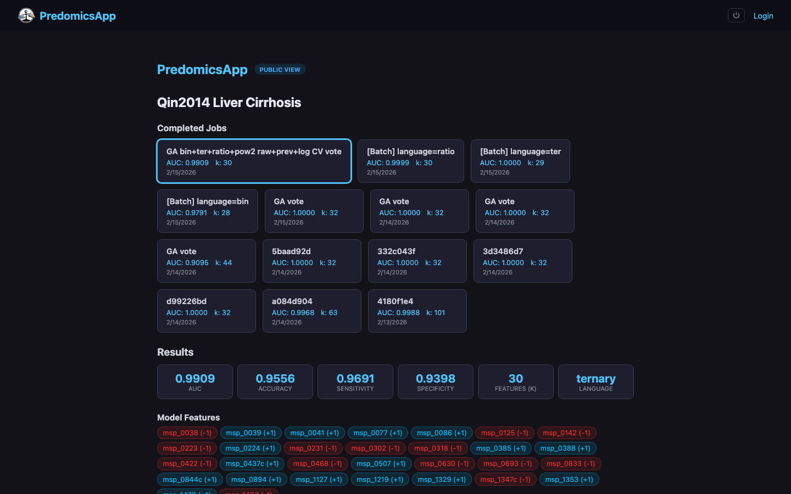 |

## Architecture

```
┌─────────────────────────────────────────────────┐
│                    NGINX / Docker                │
│  ┌──────────────┐       ┌─────────────────────┐ │
│  │   Vue.js 3   │ ◄───► │   FastAPI (Python)   │ │
│  │   Frontend   │  REST  │     Backend          │ │
│  │  (Vite SPA)  │  + WS  │  + gpredomicspy     │ │
│  └──────────────┘       └─────────┬───────────┘ │
│                                   │              │
│                          ┌────────▼────────┐     │
│                          │   PostgreSQL     │     │
│                          │   (async)        │     │
│                          └─────────────────┘     │
└─────────────────────────────────────────────────┘
```

- **Frontend**: Vue 3 + Pinia + Vue Router + Plotly.js + Vite
- **Backend**: FastAPI + SQLAlchemy (async) + gpredomicspy engine
- **Database**: PostgreSQL (production) / SQLite (development)
- **Deployment**: Docker Compose with multi-stage build

## Quick Start

### Docker (recommended)

```bash
docker compose up --build
```

App available at **http://localhost:8001**. API docs at http://localhost:8001/docs.

A default admin account is created on first run (email: `admin@predomics.org`, password: `admin`).

### Development

**Backend:**

```bash
cd backend
python -m venv .venv
source .venv/bin/activate
pip install -e ".[dev]"

# Optional: install gpredomicspy for real ML engine
# pip install ../gpredomicspy  # or: cd ../gpredomicspy && maturin develop

uvicorn app.main:app --reload
```

**Frontend:**

```bash
cd frontend
npm install
npm run dev
```

Frontend at http://localhost:5173, API at http://localhost:8000.

## Project Structure

```
predomicsapp-web/
├── backend/
│   ├── app/
│   │   ├── main.py                # FastAPI app + DB migrations
│   │   ├── core/
│   │   │   ├── config.py          # Pydantic settings
│   │   │   ├── database.py        # Async SQLAlchemy engine
│   │   │   ├── deps.py            # Dependency injection (auth, DB)
│   │   │   ├── security.py        # JWT + bcrypt utilities
│   │   │   ├── cache.py           # TTL cache decorator
│   │   │   ├── errors.py          # Structured error responses
│   │   │   └── rate_limit.py      # slowapi rate limiter
│   │   ├── models/
│   │   │   ├── db_models.py       # SQLAlchemy models (14 tables)
│   │   │   ├── schemas.py         # Pydantic request/response models
│   │   │   └── auth_schemas.py    # Auth-specific schemas
│   │   ├── routers/               # API endpoints (16 routers)
│   │   │   ├── auth.py            # Login, register, API keys, password reset
│   │   │   ├── projects.py        # Project CRUD
│   │   │   ├── datasets.py        # Dataset upload, versioning
│   │   │   ├── analysis.py        # Job launch, status, results, validation
│   │   │   ├── data_explore.py    # Data exploration & MSP annotations
│   │   │   ├── export.py          # CSV, HTML, notebook, PDF export
│   │   │   ├── predict.py         # Model deployment API
│   │   │   ├── sharing.py         # Project sharing between users
│   │   │   ├── public.py          # Public share links (no auth)
│   │   │   ├── comments.py        # Project comments CRUD
│   │   │   ├── dashboard.py       # Dashboard stats & activity
│   │   │   ├── admin.py           # Admin panel, audit log, backups
│   │   │   ├── templates.py       # Parameter templates CRUD
│   │   │   ├── webhook_router.py  # Webhook CRUD & delivery
│   │   │   ├── websocket.py       # WebSocket live logs
│   │   │   ├── samples.py         # Sample data endpoints
│   │   │   └── health.py          # Health check
│   │   └── services/              # Business logic
│   │       ├── engine.py          # gpredomicspy integration
│   │       ├── worker.py          # Background job runner
│   │       ├── storage.py         # File storage service
│   │       ├── prediction.py      # Shared prediction service (validate + API)
│   │       ├── pdf_report.py      # PDF biomarker report generation
│   │       ├── data_analysis.py   # Data exploration computations
│   │       ├── msp_annotations.py # MSP taxonomy from biobanks.gmt.bio
│   │       ├── audit.py           # Audit logging service
│   │       ├── backup.py          # Backup/restore service
│   │       ├── email.py           # SMTP email (optional)
│   │       └── webhooks.py        # Webhook delivery with HMAC
│   ├── tests/                     # 215 pytest tests
│   └── pyproject.toml
├── frontend/
│   ├── src/
│   │   ├── views/                 # Page components
│   │   │   ├── HomeView.vue       # Landing page
│   │   │   ├── LoginView.vue      # Authentication
│   │   │   ├── DashboardView.vue  # Global dashboard overview
│   │   │   ├── ProjectsView.vue   # Project list
│   │   │   ├── ProjectDashboard.vue # Project layout (tabs + console)
│   │   │   ├── DataTab.vue        # Data upload & exploration
│   │   │   ├── ParametersTab.vue  # Algorithm configuration
│   │   │   ├── ResultsTab.vue     # Results visualization (5 sub-tabs)
│   │   │   ├── DatasetLibrary.vue # Shared dataset management
│   │   │   ├── PublicShareView.vue # Public read-only results page
│   │   │   ├── AdminView.vue      # Admin panel
│   │   │   └── ProfileView.vue    # User profile, API keys, webhooks
│   │   ├── components/            # Reusable UI components
│   │   ├── stores/                # Pinia state management
│   │   ├── composables/           # Vue composables (chart theme, toast)
│   │   ├── data/parameterDefs.js  # Parameter definitions & validation
│   │   └── __tests__/             # 59 Vitest tests
│   ├── package.json
│   └── vite.config.js
├── data/qin2014_cirrhosis/        # Demo dataset (Qin et al. 2014)
├── docs/
│   ├── screenshots/               # App screenshots for documentation
│   └── capture_screenshots.mjs    # Playwright screenshot automation
├── Dockerfile                     # Multi-stage build
├── docker-compose.yml             # Production compose
├── docker-compose.dev.yml         # Development compose
├── DEPLOYMENT.md                  # Production deployment guide
└── ROADMAP.md                     # Feature roadmap (34 items, 32 done)
```

## API Endpoints

### Authentication
| Method | Endpoint | Description |
|--------|----------|-------------|
| POST | `/api/auth/register` | Create account |
| POST | `/api/auth/login` | Login (returns JWT) |
| GET | `/api/auth/me` | Current user profile |
| PUT | `/api/auth/me` | Update profile |
| PUT | `/api/auth/me/password` | Change password |
| POST | `/api/auth/forgot-password` | Request password reset |
| POST | `/api/auth/reset-password` | Reset with token |
| POST | `/api/auth/api-keys` | Create API key |
| GET | `/api/auth/api-keys` | List API keys |
| DELETE | `/api/auth/api-keys/{id}` | Revoke API key |

### Projects & Datasets
| Method | Endpoint | Description |
|--------|----------|-------------|
| POST | `/api/projects/` | Create project |
| GET | `/api/projects/` | List projects |
| GET | `/api/projects/{id}` | Get project |
| DELETE | `/api/projects/{id}` | Delete project |
| POST | `/api/projects/{id}/datasets` | Upload dataset files |
| POST | `/api/sharing/{id}/share` | Share project with user |

### Analysis & Results
| Method | Endpoint | Description |
|--------|----------|-------------|
| POST | `/api/analysis/{id}/run` | Launch analysis job |
| POST | `/api/analysis/{id}/batch` | Launch batch sweep |
| GET | `/api/analysis/{id}/jobs` | List jobs |
| GET | `/api/analysis/{id}/jobs/{jid}/detail` | Full job results |
| WS | `/ws/jobs/{pid}/{jid}` | Live log stream |

### Export & Reports
| Method | Endpoint | Description |
|--------|----------|-------------|
| GET | `/api/export/{pid}/jobs/{jid}/csv/{section}` | CSV export (coefficients, population, jury) |
| GET | `/api/export/{pid}/jobs/{jid}/report` | HTML report |
| GET | `/api/export/{pid}/jobs/{jid}/notebook/python` | Python notebook |
| GET | `/api/export/{pid}/jobs/{jid}/notebook/r` | R notebook |
| GET | `/api/export/{pid}/jobs/{jid}/pdf` | PDF biomarker report |

### Prediction & Validation
| Method | Endpoint | Description |
|--------|----------|-------------|
| POST | `/api/predict/{jid}` | Score samples via JSON (model deployment) |
| POST | `/api/analysis/{pid}/jobs/{jid}/validate` | Validate with uploaded TSV files |

### Dashboard & Collaboration
| Method | Endpoint | Description |
|--------|----------|-------------|
| GET | `/api/dashboard/` | Global stats & activity feed |
| POST | `/api/analysis/{pid}/comments` | Create project comment |
| GET | `/api/analysis/{pid}/comments` | List project comments |
| POST | `/api/projects/{pid}/public` | Create public share link |
| GET | `/api/public/{token}` | Access shared project (no auth) |
| GET | `/api/public/{token}/jobs/{jid}/results` | Access shared results (no auth) |

### Data Exploration
| Method | Endpoint | Description |
|--------|----------|-------------|
| POST | `/api/data/{id}/explore` | Feature statistics & filtering |
| POST | `/api/data/{id}/annotations` | MSP taxonomic annotations |

Full interactive API docs available at `/docs` (Swagger) and `/redoc` (ReDoc).

## Results Visualization

The Results tab provides five analytical sub-tabs:

### Summary
Key metrics (AUC, features, time), AUC evolution over generations (train vs test), model complexity tracking, and fit-vs-AUC convergence plots.

### Best Model
Detailed metrics table, radar chart (accuracy, sensitivity, specificity, AUC), model coefficients with horizontal bar chart (colored by sign), waterfall contribution chart, and per-sample contribution heatmap. Includes **Validate on New Data** (upload external cohort), **Prediction API** endpoint with curl example, and **PDF report** download.

### Population
Population-level analysis with composition by language and data type, AUC distribution, feature frequency across the population, and optional FBM (Family of Best Models) filtering.

### Co-presence
Feature co-occurrence analysis across the model population:
- **Prevalence chart** — Horizontal bars showing how often each feature appears in population models
- **Functional annotations** — Butyrate production, inflammation, transit speed, oral origin markers from biobanks.gmt.bio
- **Co-occurrence heatmap** — Viridis-colored matrix of pairwise co-occurrence counts
- **Network visualization** — Force-directed, circle, grid, or radial layouts with edges colored by co-occurrence type (positive/negative)
- **Statistics table** — Pairwise co-occurrence with hypergeometric p-values

### Comparative
Side-by-side comparison of multiple jobs: metrics table with best-value highlighting, configuration diff showing only differing parameters.

## Testing

```bash
# Backend (215 tests, ~86% coverage)
cd backend
pip install -e ".[dev]"
pytest -v

# Frontend (59 tests)
cd frontend
npx vitest run
```

## Deployment

See [DEPLOYMENT.md](DEPLOYMENT.md) for production deployment instructions including:
- Docker Compose with PostgreSQL
- NGINX reverse proxy with SSL
- Kubernetes manifests
- Backup & restore procedures
- Environment variable reference

## Technology Stack

| Layer | Technology |
|-------|-----------|
| Frontend | Vue 3, Pinia, Vue Router, Plotly.js, Vite |
| Backend | FastAPI, SQLAlchemy (async), Pydantic |
| ML Engine | gpredomicspy (Rust + Python) |
| Database | PostgreSQL / SQLite |
| Auth | JWT (Bearer) + API Keys (X-API-Key) |
| Real-time | WebSocket + HTTP polling fallback |
| Deployment | Docker, Docker Compose, NGINX |
| Testing | pytest (backend), Vitest (frontend) |

## License

GPL-3.0
